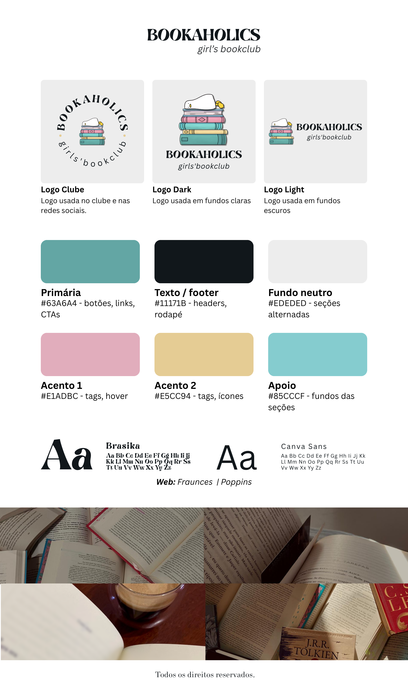

# 📚 Clube do Livro Bookaholics

Landing page desenvolvida para o **Clube do Livro Bookaholics**, com o objetivo de apresentar o clube, divulgar os livros já lidos e captar interessados para a lista de espera.

O projeto inclui a criação da **identidade visual**, desenvolvimento da interface responsiva e integração do formulário de inscrição.

**Stack:** React · Vite · JavaScript · Tailwind CSS · Formspree

---

## Identidade visual

A identidade visual do **Clube do Livro Bookaholics** foi desenvolvida especialmente para o projeto e serviu como base para a construção da interface.

A paleta de cores e os elementos visuais foram aplicados de forma consistente nos componentes, seções, botões, tags e elementos interativos da landing page.



---

## Funcionalidades

* Apresentação do clube
* Carrossel de livros já lidos
* Layout responsivo para desktop, tablet e mobile
* Navegação entre as seções da página
* Formulário para lista de espera
* Envio das inscrições por e-mail através do Formspree
* Links para Instagram e TikTok
* Link direto para contato por e-mail
* Interface desenvolvida com Tailwind CSS
* Hot Module Replacement (HMR) durante o desenvolvimento

---

## Tecnologias

* **React**
* **Vite**
* **JavaScript**
* **Tailwind CSS**
* **Lucide React**
* **React Icons**
* **Formspree**

---

## Estrutura do projeto

```text
src/
├── components/
│   └── ui/
│       ├── Button.jsx
│       ├── Card.jsx
│       └── SectionTitle.jsx
│
├── data/
│   └── books.js
│
├── layout/
│   ├── Footer.jsx
│   └── Header.jsx
│
├── sections/
│   ├── Books.jsx
│   ├── Hero.jsx
│   ├── HowItWorks.jsx
│   └── JoinSection.jsx
│
├── App.jsx
├── main.jsx
└── index.css
```

> A estrutura pode variar conforme a evolução do projeto.

---

## Como executar o projeto

### Pré-requisitos

Antes de começar, você precisa ter instalado:

* [Node.js](https://nodejs.org/)
* npm

### 1. Clone o repositório

```bash
git clone <URL_DO_REPOSITORIO>
```

### 2. Entre na pasta do projeto

```bash
cd <NOME_DO_PROJETO>
```

### 3. Instale as dependências

```bash
npm install
```

### 4. Execute o projeto

```bash
npm run dev
```

Depois, acesse a URL exibida pelo Vite no terminal, normalmente:

```text
http://localhost:5173
```

---

## Formulário de inscrição

O formulário da lista de espera utiliza o **Formspree** para processar as inscrições.

A integração é feita através do `@formspree/react`:

```jsx
import { useForm } from "@formspree/react";

const [state, handleSubmit] = useForm("SEU_FORM_ID");
```

Os dados enviados pelo formulário são:

* Nome
* E-mail
* Telefone/WhatsApp

Após o envio bem-sucedido, o usuário recebe uma mensagem de confirmação na própria página.

### Configuração do Formspree

Para utilizar outro formulário, substitua o ID:

```jsx
useForm("SEU_FORM_ID")
```

pelo ID fornecido pelo Formspree.

---

## Responsividade

A interface foi desenvolvida pensando em diferentes tamanhos de tela.

O carrossel de livros adapta automaticamente a quantidade de cards exibidos:

| Tela           | Cards |
| -------------- | ----: |
| Mobile         |     1 |
| Tablet pequeno |     2 |
| Tablet         |     3 |
| Desktop        |     4 |

A navegação principal também é adaptada para dispositivos móveis.

---

## Carrossel de livros

Os livros são armazenados no arquivo:

```text
src/data/books.js
```

Cada livro possui informações como:

```js
{
    id: 1,
    image: "URL_DA_IMAGEM",
    title: "Nome do livro",
    author: "Autor",
    date: "Janeiro/2026",
}
```

O carrossel permite:

* Navegação manual
* Avanço automático
* Navegação pelos indicadores
* Adaptação responsiva
* Exibição de quantidade variável de livros

---

## Componentes reutilizáveis

O projeto utiliza componentes de UI para manter a interface consistente e facilitar futuras alterações.

### Button

Botão reutilizável com possibilidade de customização através de `className`.

### Card

Componente utilizado para estruturar diferentes conteúdos da página, incluindo os cards dos livros e o formulário.

### SectionTitle

Componente responsável pelos títulos das seções, permitindo diferentes variantes visuais.

---

## Scripts disponíveis

### Desenvolvimento

```bash
npm run dev
```

Executa o ambiente de desenvolvimento com Vite.

### Build

```bash
npm run build
```

Gera a versão de produção.

### Preview

```bash
npm run preview
```

Executa localmente a versão de produção gerada pelo Vite.

### Lint

```bash
npm run lint
```

Executa o ESLint para verificar problemas no código.

---

*Code by [Dyovana Menegatti](https://www.linkedin.com/in/dyomenegatti/).*